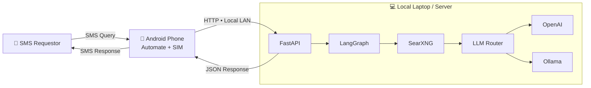

# SMS-AI-Websearch

   

## 📑 Table of Contents

- [Description](#description)
- [Tech Stack](#tech-stack)
- [Architecture](#architecture)
- [Quick Start](#quick-start)
- [Environment Variables](#environment-variables)
- [Key Dependencies](#key-dependencies)
- [Project Structure](#project-structure)
- [Development Setup](#development-setup)
- [Contributors](#contributors)
- [Contributing](#contributing)

## 📝 Description

SMS-AI-Websearch — Purposed for the cell phones without internet access to have websearch access over sms. 
A backend api built with FastAPI, Python. 

## 🛠️ Tech Stack

 

**Notable libraries:** OpenAI, Uvicorn

## 🏗️ Architecture

A high-level view of how the main pieces fit together:


Yes. Here is the **Mermaid version of that exact architecture**, designed to work cleanly in GitHub README:



## ⚡ Quick Start

```bash

# 1. Clone the repository
git clone https://github.com/coolomya/SMS-AI-Websearch.git

# 2. Create & activate a virtualenv
python -m venv venv && source venv/bin/activate

# 3. Install dependencies
pip install -r requirements.txt

# 4. Configure environment
cp .env.example .env

# Run the API
uvicorn main:app --reload --host 0.0.0.0
```

Make sure to use 0.0.0.0 as host, otherwise api will not be accessible over same wifi network.

---

## 🐳 External Infrastructure Services Setup

### 1. Containerized SearXNG Engine
Run a localized instance of SearXNG inside Docker:

```bash
docker run -d \
  -p 8080:8080 \
  --name local-searxng \
  --restart unless-stopped \
  -e SEARXNG_SETTINGS_URL=/etc/searxng/settings.yml \
  searxng/searxng:latest
```

### 2. Local Ollama Inference Node
Ensure Ollama is running locally and pull your target model weights:

```bash
ollama pull llama3.2:3b
```

---


## 🔑 Environment Variables

The following environment variables are required (see `.env.example`):

```bash
APP_TITLE=
SEARXNG_URL=
MAX_RETRY_COUNT=
OPENAI_API_KEY=
OPENAI_MODEL=
OLLAMA_MODEL=
```

## 📦 Key Dependencies

```
langgraph: latest
ollama: latest
openai: latest
fastapi: latest
uvicorn: latest
httpx: latest
pydantic_settings: latest
```

## 📁 Project Folder Layout

```text
.
├── api/          # REST API endpoints & LLM sandbox routers
├── config/       # Logging & centralized Pydantic settings
├── graph/        # LangGraph states, nodes, edges & workflow builder
├── services/     # LLM providers (OpenAI, Ollama, router) & SearXNG search client
├── .env.example  # Configuration template
├── main.py       # ASGI server initialization
└── requirements.txt
```

## 📁 Project Structure

```
.
├── .env.example
├── docs
│   └── ANDROID_SETUP.md
├── api
│   └── routes.py
├── config
│   ├── logging_config.py
│   └── settings.py
├── graph
│   ├── edges.py
│   ├── nodes.py
│   ├── state.py
│   └── workflow.py
├── main.py
├── requirements.txt
└── services
    ├── llm
    │   ├── base.py
    │   ├── ollama_svc.py
    │   ├── openai_svc.py
    │   └── router.py
    └── search
        └── searxng.py
```

## 🛠️ Development Setup

### Python
1. Install Python (v3.10+ recommended)
2. `python -m venv venv && source venv/bin/activate`  (Windows: `venv\Scripts\activate`)
3. `pip install -r requirements.txt`

## 📱 Android SMS Integration

The project can be accessed through an Android phone with a
working SIM card as a middleware. The Android device uses Automate by LlamaLab to receive
SMS queries from non-android phone, forward them to the local FastAPI server over the LAN, and
send the AI-generated response back via SMS.

For the complete Android/Automate configuration and deployment instructions,
see **[Android SMS Bridge Setup](docs/ANDROID_SETUP.md)**.

## 👥 Contributors

Thanks to everyone who has contributed to this project:

<p align="left">
<a href="https://github.com/coolomya" title="coolomya"></a>
</p>

[See the full list of contributors →](https://github.com/coolomya/SMS-AI-Websearch/graphs/contributors)

## 👥 Contributing

Contributions are welcome! Here's the standard flow:

1. **Fork** the repository
2. **Clone** your fork: `git clone https://github.com/coolomya/SMS-AI-Websearch.git`
3. **Branch**: `git checkout -b feature/your-feature`
4. **Commit**: `git commit -m 'feat: add some feature'`
5. **Push**: `git push origin feature/your-feature`
6. **Open** a pull request

Please follow the existing code style and include tests for new behavior where applicable.

---

<div align="center">

[](https://readmebuddy.com)

<sub>Generate beautiful READMEs in seconds → <a href="https://readmebuddy.com">readmebuddy.com</a></sub>

</div>
